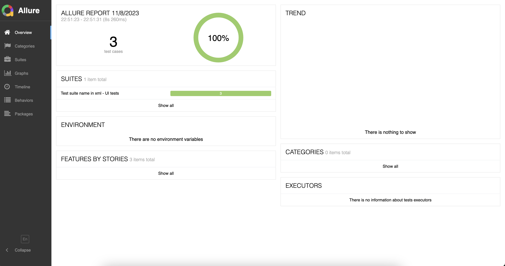
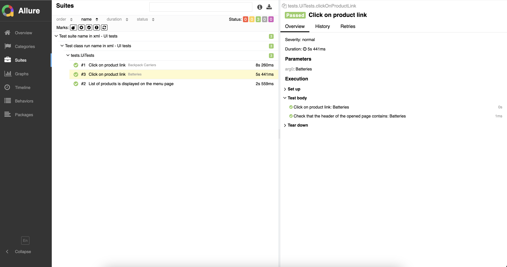
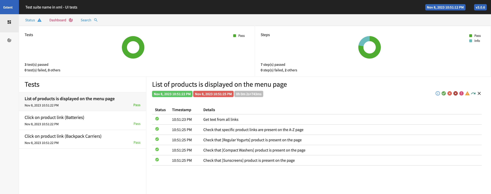

# Just another simple framework for writing and running Selenium tests (Java + Maven + TestNG + Selenium)

## Preconditions

- Java JDK is installed and configured
- Maven is installed and configured
- IntelliJ IDEA community edition is installed or any other IDE of your choice
- Firefox browser is installed (by default tests are running in Firefox, but you can change it in config)
- You will need to have some knowledge on how to write xpath locators for web elements

### macOS/Windows note

I use macOS for development, but the framework should work in Windows as well. Code inside is written in the way to work with both OS. Initially I used Windows when I started implementing this framework, so it worked with windows back then, and it should now. It's just that I do not have Windows right now to test everything in both platforms. But please let me know if you face any issues or something does not work.

### Java version note

I use Java 1.8 Oracle Open JDK 1.8.0_361 (since I need Java 8 for work) to run this project. So unless you are forced to use Java 11 or any other Java version > 8, please install and use JDK 1.8.0_XXX. Probably you can also simply set in IDE settings: File - Project Structure - Project - Language level = 8, but I did not test those configurations.

## Description

## How to start using the project

1. Download the project using green button [Code] on the top right -> then select [Download ZIP]. Or you can clone the repo from GitHub but, most likely, you will need to configure SSH key to do so.
2. Unzip the project folder to the location of your choosing on your laptop.
3. Start your IDE (IntelliJ IDEA/Eclipse/etc.). Then in IDE go to menu File -> Open and select the folder from previous step where you downloaded and unzipped the project to. You should select the folder that has src folder and pom.xml inside it. If you select a folder at another nesting level - IDE will not properly recognize it as a project.
4. Then you need to specify Java SDK in the IDE menu File -> Project Structure -> SDK. Select JDK that you have installed and configured on your machine.

### Supported browsers

1. chrome
2. firefox
3. edge
4. safari

By default, I would recommend to use Firefox. For some reasons, Chrome with Selenium behaves very slow on my machine.

### Config

Config can be found in "config/tests.properties"

```
startUrlForAllTests = https://www.consumerreports.org/cro/a-to-z-index/products/index.htm
#seleniumGrid = http://10.157.153.36:4444/wd/hub
implicitWaitTimeout = 5
browser = firefox
#browser = chrome
#browser = edge
#browser = safari
```

Test run report will be created in 'logs' folder.

HTML page sources are saved to the 'pagesources' folder for failed tests.

Screenshots are saved to the 'screenshots' folder for failed tests.

Create your Page Object classes in - src/test/java/pages

Create your Test scenarios classes in - src/test/java/tests

`startUrlForAllTests` value in config - all tests will be started by opening this url in a browser.

`src/test/java/tests/UiTests` - UI selenium tests example

`src/test/java/tests/ApiTests` - API tests example

## How to run tests

### Method 1

Most likely, during local development, you will be running your tests using green "run" icon on the left of your test method names.
This is the fastest, but the least desirable way to run tests because it does not take into account configurations from maven pom.xml or TestNG xml file (tests will be run without any listeners specified in TestNG xml file).
But this is not the way your tests will be run on CI/CD, just keep that in mind.

### Method 2

Tests can also be run through the IDE itself or maven goal "test". From the root of the project run:

```
mvn clean test
```

Please keep in mind that `mvn clean test` will run whatever is specified in the pom.xml inside `suiteXmlFiles` tag

```
<suiteXmlFiles>
  <suiteXmlFile>testNgUITestSuite.xml</suiteXmlFile>
</suiteXmlFiles>
```

In IntelliJ IDEA, tests can be run via Run -> Edit Configurations menu, add 'TestNG - Suite' configuration and specify the path to the testng xml file.

### Method 3

At the root of the project there is a couple of testng xml files, where you can specify which classes with tests to be run.
You will need these files when running from CI/CD like Jenkins etc.
Most likely you are not going to use them during local development of your tests on your machine.

`testNgUITestSuite.xml`

`testNgApiTestSuite.xml`

```
<?xml version="1.0" encoding="UTF-8"?>
<!DOCTYPE suite SYSTEM "http://testng.org/testng-1.0.dtd">
<suite name="Test suite name in xml - UI tests" parallel="methods" thread-count="3" data-provider-thread-count="2">
    <listeners>
        <listener class-name="listeners.TestListener" />
        <listener class-name="listeners.retry.RetryTestListener" />
    </listeners>
    <test name="Test class run name in xml - UI tests">
        <classes>
            <class name="tests.UiTests" />
        </classes>
    </test>
</suite>
```

## Capabilities

Tests can be run in parallel. The number of threads can be adjusted in testng xml file, e.g.: thread-count = "2" data-provider-thread-count = "2"

Tests retry mechanism is also implemented and in place. By default, retry runs only when you run your tests on selenium grid and does not run when you run tests locally, otherwise it makes test debugging annoying.

## HTML report

To generate and see Allure report, install Allure command line tools first, for example from here https://www.npmjs.com/package/allure-commandline

Run `npm install -g allure-commandline` if you have npm installed.

Then you can run command from the root of the project:

```
allure serve allure-results
```

Allure report will be generated and automatically opened in your default browser.




Additional standalone HTML report file (Extent Reports) is created in 'logs' folder (when running via maven).



## Browsers drivers management

Unless something goes wrong, you don't have to download browser drivers manually, it is being managed by the WebDriverManager library added to the project.

```
<dependency>
  <groupId>io.github.bonigarcia</groupId>
  <artifactId>webdrivermanager</artifactId>
  <version>5.5.3</version>
</dependency>
```

## Hanging / lost driver processes

Please keep in mind that if driver.quit() failed for any reasons and if you have any browser window left open after your test ended - closing it via close button is not enough.

You will need to kill it in processes on OS level using command like `killall -9 chromedriver` or similar.

# Troubleshooting

## Error zsh: command not found: mvn

```
cd ~/
code .zshrc
```

add lines and save, restart terminal

```
export M3_HOME="/Applications/IntelliJ IDEA CE.app/Contents/plugins/maven/lib/maven3"
export M3=$M3_HOME/bin
export PATH=$M3:$PATH
```

Or do a separate maven installation outside IDE.

## No compiler is provided in this environment. Perhaps you are running on a JRE rather than a JDK?

If you try to run via `mvn clean test` and see the error
```
[ERROR] Failed to execute goal org.apache.maven.plugins:maven-compiler-plugin:3.10.1:testCompile (default-testCompile) on project tests: Compilation failure
[ERROR] No compiler is provided in this environment. Perhaps you are running on a JRE rather than a JDK?
```
Try to add JAVA_HOME variable with your JDK path into your .zshrc config file for your terminal (if you use zsh and not bash, for bash you will need to add it to .bash_profile config) which should be located in your user home folder (cd ~/ on a Mac).
```
export JAVA_HOME=/Library/Java/JavaVirtualMachines/jdk1.8.0_361.jdk/Contents/Home
```

## Manual drivers download

If the web driver manager does not work for you for some reasons and you have to download browser drivers manually from e.g. https://chromedriver.chromium.org/downloads

The following command might be useful on Mac to mark drivers as safe to run by macOS

`sudo xattr -dr com.apple.quarantine "PATH_TO_REPO/drivers/chromedriver" && sudo chmod -R 777 "PATH_TO_REPO/drivers/chromedriver"`

---

<a href="https://www.buymeacoffee.com/slavabulba" target="_blank"></a>